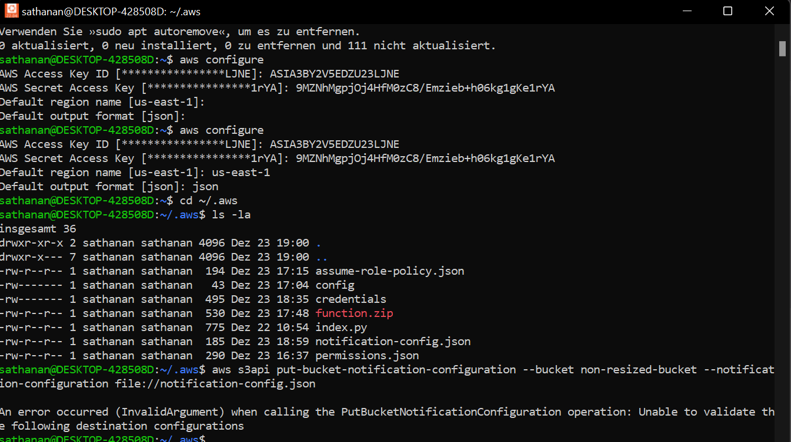

# 📌 M346 PA :: Bildverkleinerung

Willkommen zu der offiziellen Dokumentation über unsere Projektarbeit für das Modul 346, Bildverkleinerung.

## **Inhalt**

[🔹 Vorwort](#vorwort)
 
[🔹 Installation](#to-do)
 
[🔹 Benutzung](#benutzung)
 
[🔹 Schlusswort](#schlusswort)
 
[🔹 Erstellen ](#erstellen)

### To-Do

- [ ] Setup Script
- [x] Cleanup Script
- [ ] Run Script

### Vorwort

Das Informatikprojekt wurde teilweise im Unterricht und grösstenteils zuhause erarbeitet.
Unsere Gruppe welche aus Luis Viethen, Thi Nguyen und Livio Piccolotto besteht hat ein Projekt zum Thema "Bildverkleinerung".

### Installation

Wichtig ist, dass man die Amazon CLI installiert hat. Das ist eine Befehlszeilenschnittstelle welche mit dem AWS von Amazon interagieren kann. Ohne diese Brücke ist das ganze nicht möglich.

Um dies zu machen, muss man auf Amazon gehen und eine Datei herunterladen. Um die Installation abzuschliessen und zu bestätigen muss man das CMD im normalen Windows geöffnet werden und den command "aws --version" eingeben. Nun ist die Instalation erforlgrech abgeschlossen. Im Anschluss wird diese noch eine wichtige Rolle spielen.

## Erstellen 

Das ganze Script haben wir als Klasse erstellt, weil es niemand in der Gruppe geschafft hat.

Beim Erstellen von dem Script oder bessergesagt von den verschiedenen Scripts sind wir nach dem Aufbau der Aufgabe vorgegangen. Wir haben uns dazu entschieden die einzelnen Aufgaben der Aufgabe in verschiedenen Teil-Scripte aufzuteilen umso mehr Ordnung, Struktur und Übersicht in das ganze Projekt hineinzubringen. Als erstes haben wir mit der Setup Datei begonen um die Logischen Aufbauschritte des Aufgabe zu befolgen. In diesem werden die zwei S3 Buckets erstellt, es wird die Lambdafunktion aufgerufen, zu all diesen Prozessen wird auch immer ein Echo ausgegeben, welches den erfolgreichen oder nicht erfolgreichen Ausführungen des Codes einem mitteilt. Diese Notifications werden zusätzlich in eine Datei ausgespeichert. Es werden auch verschiede Variabeln angelegt welche einen Inhalt bekommen. Die Labrole wurde für den Zugang hinzugefügt.

Wir habe noch ein weiteres Script erstellt welches "cleanup.sh" heisst. Der Name ist selbsterklärend, es ist dafür zuständig, dass alle Dateien und Buckets wieder gelöscht werden nach ihrem Einsatzt. Dies hat uns Herr Bischofberger gezeigt und empfohlen. So sollte das Ganze auch bei mehrmaligem Verwenden problemlos und ohne Ruckler laufen.

Im Ordner func wird die Lambdafunktion selber geschieben welche das Bild beim Ausführen verkleinert. dafür hat eine config Datei, welche nochmals alle Variablen auflistet. In der "func.js" Datei wird die "export.handler" verwendet, welcher die Datei nachher auch wieder zurückschickt. Mit dem Status Code 200 wird bei einem erfolgreichen umwandeln angegeben das der Prozess funktioniert hat. Die Datei wird auch noch in ein String File umgewandelt/angegeben. Daraus entsteht dann als Produkt eine func.zip. Die wir aber eigentlich im "setup.sh" erstellt.

Wir haben auch einzelen Codestücke getestet und erst danach in unseren code integriert. Es folgt ein Beispiel:

### Benutzung

Die Benutzung sollte eigentlich sehr simple sein. Man kan zwei Buckets erstellen und ein Bild hochladen welches dan verkleinert wird. Im anschluss wird dieses wieder zurückgegeben und alle Buckets werden automatisch wieder gelösch.

### Schlusswort

Das Projekt ansich war sehr Zeitaufwendig. Man musste viele Sachen nochmals lernen/lesen und auch code welchen man nicht in der Schule hatte noch selbständig erlernen oder das wissen sicha ufbauen, wie diesen zu verwenden. Weil das Projekt bei den meisten nicht funktioniert hat haben wir uns am Ende dazu entschlossen das Projekt gemeinsam in Angriff zu nehmen, wie am Anfang bereits geschirebn. Ich habe also unsere ersten Versuche nicht Dokumentiert und nur unsere gemeinsame neue.

Die Bilder wurden alle selber erstellt.

